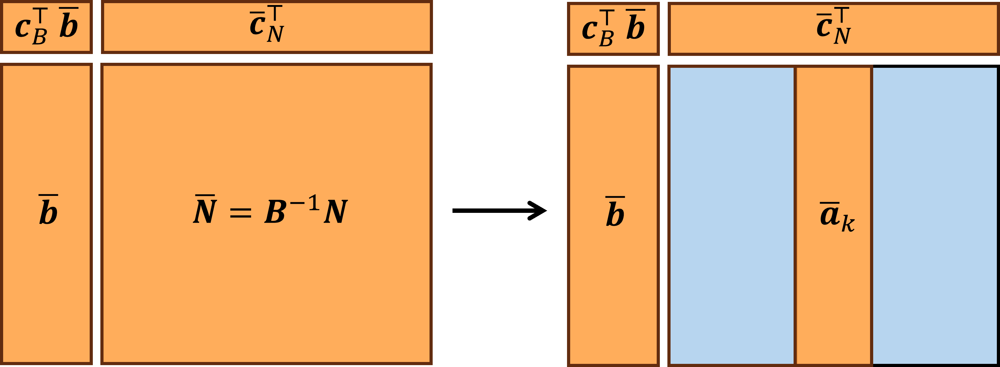
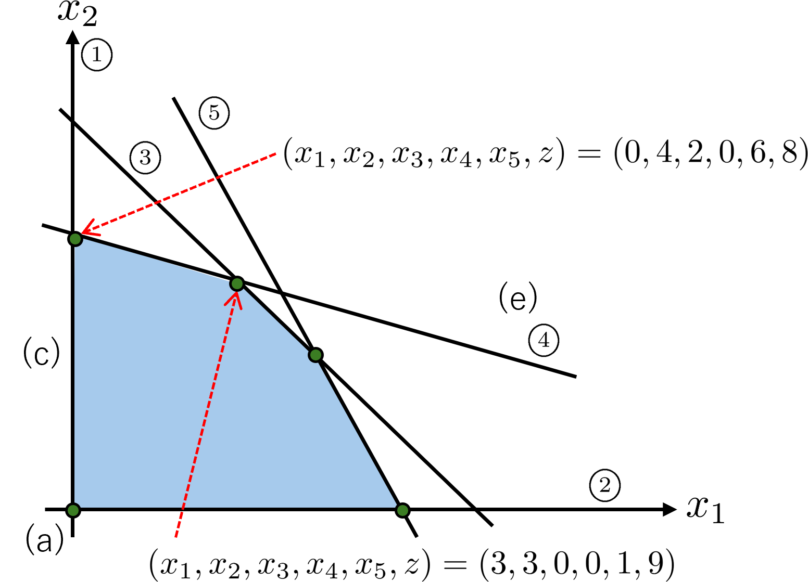
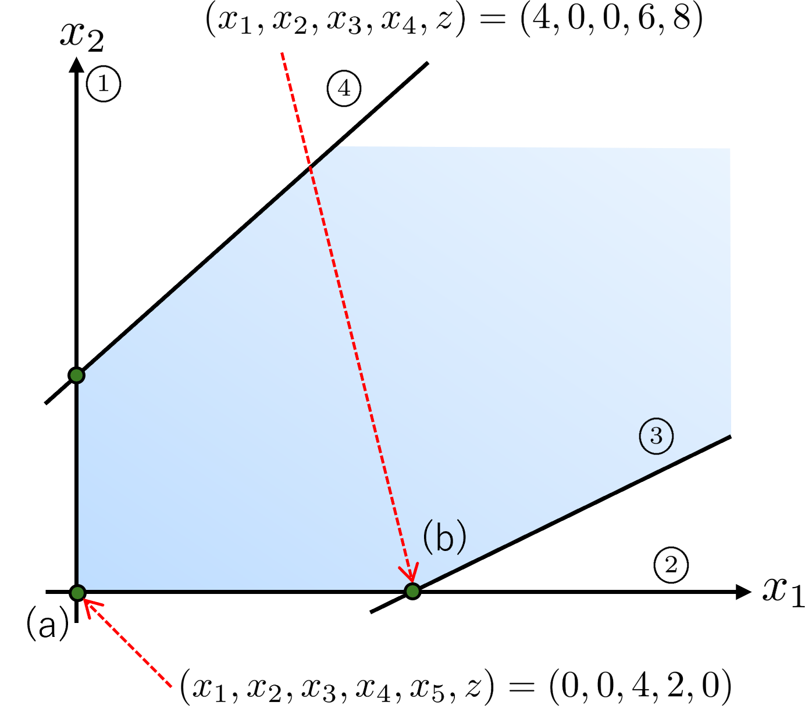
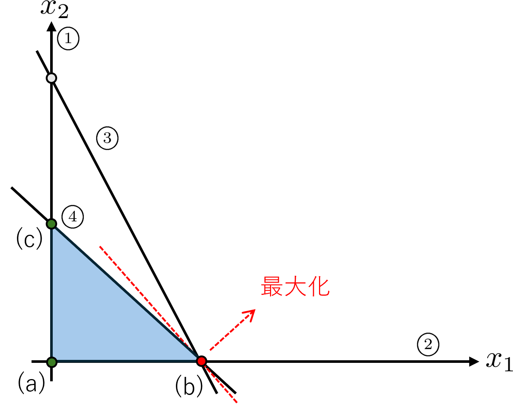
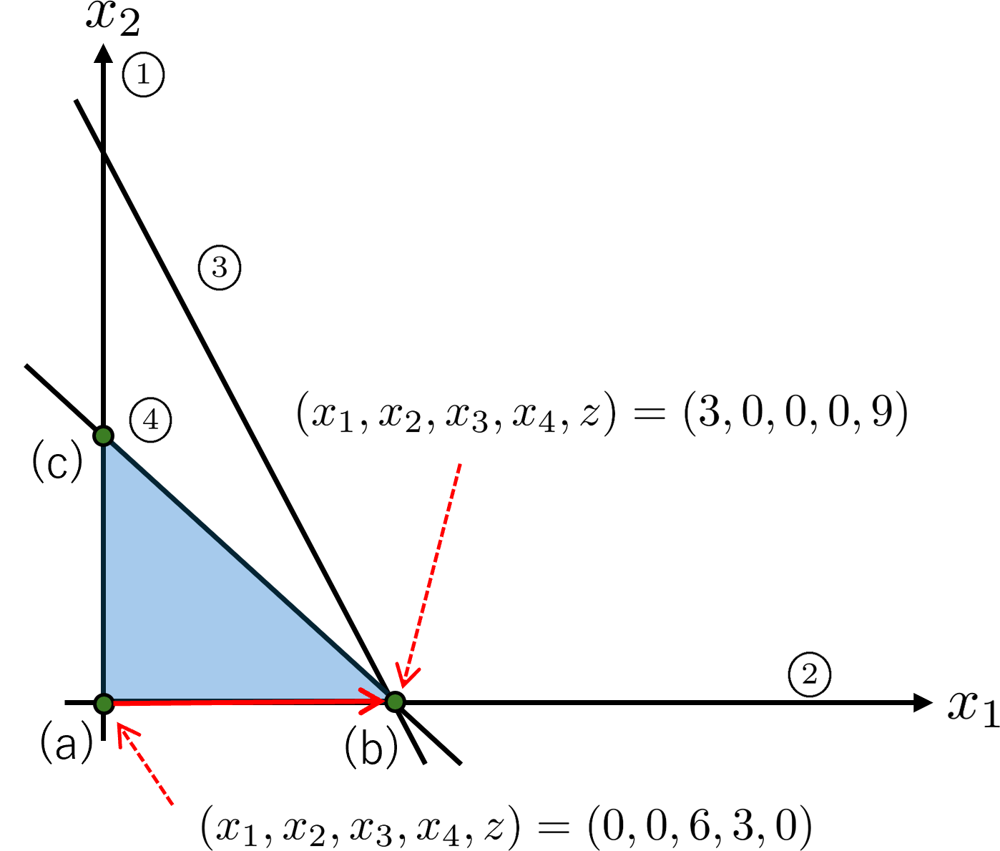

# 前回のおさらい
標準形の例
$$
\begin{aligned}
\text{最大化}\quad &x_1+2x_2\\
\text{条件}\quad &x_1\geq 0,\\
&x_2\geq 0,\\
&x_1+x_2\leq 6,\\
&x_1+3x_2\leq 12,\\
&2x_1+x_2\leq 10.
\end{aligned}
$$
スラック変数を導入すると，等価な線形計画問題は
$$
\begin{aligned}
\text{最大化}\quad &z=x_1+2x_2\\
\text{条件}\quad &x_1+x_2+x_3=6,\\
&x_1+3x_2+x_4=12,\\
&2x_1+x_2+x_5=10,\\
&x_1,x_2,x_3,x_4,x_5\geq 0.
\end{aligned}
$$
となります．  
　単体法は，次のような**辞書**を用いて，基底解を更新していく方法でした．
$$
\begin{aligned}
z&=x_1+2x_2,\\
x_3&=6-x_1-x_2,\\
x_4&=12-x_1-3x_2,\\
x_5&=10-2x_1-x_2.
\end{aligned}
$$
このとき，右辺に現れる変数を**非基底変数**と呼び，基底解を決めるときに0に固定する変数です．一方で左辺に現れる変数は**基底変数**と呼び，それ以外の変数のことです．この例では，$x_1, x_2$ が非基底変数，$x_3, x_4, x_5$ が基底変数です．単体法の手順を簡単に説明します．  
　まず，初期実行可能基底解を得るために$x_1=x_2=0$とすると，$x_3=6, x_4=12, x_5=10,z=0$が得られます．$x_1,x_2$の係数が正なので，まだ目的関数を大きくできる余地があります。  
　次に，基底変数と入れ替える非基底変数を選びます．今回は$x_2$を選んでみます．$x_1=0$はそのままなので，辞書は次のようになります．
$$
\begin{aligned}
z&=2x_2,\\
x_3&=6-x_2,\\
x_4&=12-3x_2,\\
x_5&=10-x_2.
\end{aligned}
$$
このとき，非負制約条件により，$x_2$は最大で4までしか増やせません．そこで，$x_2=4$とすると同時に$x_4=0$となるので，$x_4$が非基底変数になります．よって辞書は次のようになります．
$$
\begin{aligned}
z&=8+\frac{1}{3}x_1-\frac{2}{3}x_4,\\
x_3&=2-\frac{2}{3}x_1+\frac{1}{3}x_4,\\
x_2&=4-\frac{1}{3}x_1-\frac{1}{3}x_4,\\
x_5&=6-\frac{5}{3}x_1+\frac{1}{3}x_4.
\end{aligned}
$$
同様に辞書の更新を繰り返すと，次のような辞書が得られます．
$$
\begin{aligned}
z&=9-\frac{1}{2}x_3-\frac{1}{2}x_4,\\
x_1&=3-\frac{3}{2}x_3+\frac{1}{2}x_4,\\
x_2&=3+\frac{1}{2}x_3-\frac{1}{2}x_4,\\
x_5&=1+\frac{1}{2}x_3-\frac{1}{2}x_4.
\end{aligned}
$$
このときの非基底変数は$x_3, x_4$で，基底変数は$x_1, x_2, x_5$です．$x_3, x_4$は非負の係数が負であるため，これ以上$z$を大きくすることはできません．したがって，この辞書から得られる基底解$(x_1,x_2,x_3,x_4,x_5,z)=(3,3,0,0,1,9)$は最適解です．
# 単体法の原理
　標準形の線形計画問題を考えます．
$$
\begin{aligned}
\text{最大化}\quad &\boldsymbol{c}^\top\boldsymbol{x}\\
\text{条件}\quad &\boldsymbol{A}\boldsymbol{x}=\boldsymbol{b},\\
&\boldsymbol{x}\geq \boldsymbol{0}.
\end{aligned}
$$
ここで，$\boldsymbol{A}\in\mathbb{R}^{m\times n}, \boldsymbol{b}\in\mathbb{R}^m, \boldsymbol{c}\in\mathbb{R}^n,\boldsymbol{x}\in\mathbb{R}^n$です．このままだと分かりにくいので，先ほどの例を使って説明します．$\boldsymbol{x}=(x_3,x_4,x_5,x_1,x_2)^\top$とすると，
$$
\boldsymbol{A}=\begin{bmatrix}
  1 & 0 & 0 & 1 & 1\\
 0 & 1 & 0 & 1 & 3 \\
 0 & 0 & 1 & 2 & 1
\end{bmatrix},\quad
\boldsymbol{b}=\begin{bmatrix}
6\\
12\\
10
\end{bmatrix},\quad
\boldsymbol{c}=\begin{bmatrix}
0\\
0\\
0\\
1\\
2
\end{bmatrix}.
$$
となります．条件は$3$つで，変数は$5$つなので，$5-3=2$つは0に固定する必要があります．つまり非基底変数は$2$つ，基底変数は$3$つです．そこで，これから目的関数と条件の式を，基底変数と非基底変数に分けて書き直します．その準備として，基底変数に関するベクトル，目的関数，部分行列をそれぞれ$\boldsymbol{x}_B, \boldsymbol{c}_B, \boldsymbol{B}$とします．同様に，非基底変数に関するベクトル，目的関数，部分行列をそれぞれ$\boldsymbol{x}_N, \boldsymbol{c}_N, \boldsymbol{N}$とします．$\boldsymbol{B}$が正則であるとき**基底行列**と呼び，$\boldsymbol{N}$は**非基底行列**と呼びます．  
　例えば最初の辞書のときは，$\boldsymbol{x}_B=(x_3,x_4,x_5)^\top, \boldsymbol{x}_N=(x_1,x_2)^\top$となり，基底行列と非基底行列はそれぞれ
$$
\boldsymbol{B}=\begin{bmatrix}
1 & 0 & 0\\
0 & 1 & 0\\
0 & 0 & 1
\end{bmatrix},\quad
\boldsymbol{N}=\begin{bmatrix}
1 & 1\\
1 & 3\\
2 & 1
\end{bmatrix}
$$
となり，目的関数については
$$
\boldsymbol{c}_B=\begin{bmatrix}
0\\
0\\
0
\end{bmatrix},\quad
\boldsymbol{c}_N=\begin{bmatrix}
1\\
2
\end{bmatrix}
$$
となります．また，最適基底解$\boldsymbol{x}_B^*=(x_1^*, x_2^*, x_5^*)^\top,\boldsymbol{x}_N^*=(x_3^*, x_4^*)^\top$に対応する基底行列と非基底行列はそれぞれ
$$
\boldsymbol{B}=\begin{bmatrix}
1 & 1 & 0\\
1 & 3 & 0\\
2 & 1 & 1
\end{bmatrix},\quad
\boldsymbol{N}=\begin{bmatrix}
1 & 0\\
0 & 1\\
0 & 0
\end{bmatrix}
$$
となります．よって等式制約$\boldsymbol{A}\boldsymbol{x}=\boldsymbol{b}$は次のように書き換えられます．
$$
\boldsymbol{A}\boldsymbol{x}=\left(\boldsymbol{B}\quad \boldsymbol{N}\right) \begin{pmatrix}
\boldsymbol{x}_B\\
\boldsymbol{x}_N
\end{pmatrix}=\boldsymbol{B}\boldsymbol{x}_B+\boldsymbol{N}\boldsymbol{x}_N=\boldsymbol{b}
$$
同様に，目的関数は次のように書き換えられます．
$$
z=\boldsymbol{c}^\top\boldsymbol{x}=\left(\boldsymbol{c}_B^\top\quad \boldsymbol{c}_N^\top\right) \begin{pmatrix}
\boldsymbol{x}_B\\
\boldsymbol{x}_N
\end{pmatrix}=\boldsymbol{c}_B^\top\boldsymbol{x}_B+\boldsymbol{c}_N^\top\boldsymbol{x}_N
$$
このとき，$\boldsymbol{B}$が正則であれば，
$$
\boldsymbol{x}_B=\boldsymbol{B}^{-1}\boldsymbol{b}-\boldsymbol{B}^{-1}\boldsymbol{N}\boldsymbol{x}_N
$$
となります．これを目的関数の式に代入すると，
$$
\begin{aligned}
z&=\boldsymbol{c}_B^\top\boldsymbol{x}_B+\boldsymbol{c}_N^\top\boldsymbol{x}_N\\
&=\boldsymbol{c}_B^\top\left(\boldsymbol{B}^{-1}\boldsymbol{b}-\boldsymbol{B}^{-1}\boldsymbol{N}\boldsymbol{x}_N\right)+\boldsymbol{c}_N^\top\boldsymbol{x}_N\\
&=\boldsymbol{c}_B^\top\boldsymbol{B}^{-1}\boldsymbol{b}+\left(\boldsymbol{c}_N^\top-\boldsymbol{c}_B^\top\boldsymbol{B}^{-1}\boldsymbol{N}\right)\boldsymbol{x}_N
\end{aligned}$$
と変形できます．以上より辞書は
$$
\begin{aligned}
z&=\boldsymbol{c}_B^\top\boldsymbol{B}^{-1}\boldsymbol{b}+\left(\boldsymbol{c}_N^\top-\boldsymbol{c}_B^\top\boldsymbol{B}^{-1}\boldsymbol{N}\right)\boldsymbol{x}_N,\\
\boldsymbol{x}_B&=\boldsymbol{B}^{-1}\boldsymbol{b}-\boldsymbol{B}^{-1}\boldsymbol{N}\boldsymbol{x}_N
\end{aligned}$$
となります．ここで$\boldsymbol{x}_N=\boldsymbol{0}$とすると，ただちに$\boldsymbol{x}_B=\boldsymbol{B}^{-1}\boldsymbol{b}$が得られ，$\boldsymbol{B}^{-1}\boldsymbol{b}$の各成分が全て非負であれば実行可能基底解になります．以降，ベクトルの各成分がすべて非負であることを$\boldsymbol{B}^{-1}\boldsymbol{b}\geq \boldsymbol{0}$と表記します．  
　次に，この実行可能基底解$(\boldsymbol{x}_B,\boldsymbol{x}_N)=(\boldsymbol{B}^{-1}\boldsymbol{b},\boldsymbol{0})$が最適解かどうかを考えます．そのためには目的関数$z$における非基底変数ベクトル$\bar{\boldsymbol{x}}_N$の係数を調べればよいことが分かります．ここで．$\bar{\boldsymbol{b}}=\boldsymbol{B}^{-1}\boldsymbol{b}, \bar{\boldsymbol{c}}_N=\boldsymbol{c}_N-\boldsymbol{N}^\top(\boldsymbol{B}^{-1})^\top \boldsymbol{c}_B, \bar{\boldsymbol{N}}=\boldsymbol{B}^{-1}\boldsymbol{N}$とします．すると，辞書は次のように書き換えられます．
$$
\begin{aligned}
z&=\boldsymbol{c}_B^\top\bar{\boldsymbol{b}}+\bar{\boldsymbol{c}}_N^\top\boldsymbol{x}_N,\\
\boldsymbol{x}_B&=\bar{\boldsymbol{b}}-\bar{\boldsymbol{N}}\boldsymbol{x}_N
\end{aligned}$$
$\bar{\boldsymbol{c}}_N$を**被約費用**と呼び，1つの非基底変数$x_j$を1単位増やしたときの目的関数の改善量が$\bar{c}_j$で表されます．もしも
$\bar{\boldsymbol{c}}_N\leq \boldsymbol{0}$であれば，非基底変数の値を増やしても目的関数は改善しません．よって，この基底解は最適解になります．  
　逆に，$\bar{c}_k>0$となる非基底変数$x_k$が存在すれば，その値を増やすことで目的関数を改善できます．そこで，非基底変数のうち，1つの値$x_k$を$\theta$だけ増やし，その他を0とします．ここで$\bar{\boldsymbol{a}}_k$を$\bar{\boldsymbol{N}}$の第$k$列とすると，目的関数と基底変数は
$$
\begin{aligned}
z&=\boldsymbol{c}_B^\top\bar{\boldsymbol{b}}+\bar{\boldsymbol{c}}_N^\top \boldsymbol{x}_N\\
&=\boldsymbol{c}_B^\top\bar{\boldsymbol{b}}+\begin{bmatrix}
\bar{c}_1 & \cdots & \bar{c}_k & \cdots & \bar{c}_{n-m}
\end{bmatrix}\begin{bmatrix}
0\\
\vdots\\
\theta\\
\vdots\\
0
\end{bmatrix}\\
&=\boldsymbol{c}_B^\top\bar{\boldsymbol{b}}+\bar{c}_k\theta
\end{aligned}$$
$$
\begin{aligned}
\boldsymbol{x}_B&=\bar{\boldsymbol{b}}-\bar{\boldsymbol{N}}\boldsymbol{x}_N\\
&=\bar{\boldsymbol{b}}-\begin{bmatrix}
\bar{\boldsymbol{a}}_1 & \cdots & \bar{\boldsymbol{a}}_k & \cdots & \bar{\boldsymbol{a}}_{n-m}
\end{bmatrix}\begin{bmatrix}0\\
\vdots\\
\theta\\
\vdots\\
0
\end{bmatrix}\\
&=\bar{\boldsymbol{b}}-\bar{\boldsymbol{a}}_k\theta
\end{aligned}$$
となります．このとき，$\boldsymbol{x}_B\geq \boldsymbol{0}$を満たすためには，
$$
\theta=\min \left\{\frac{\bar{b}_i}{\bar{a}_{ik}} \middle| \bar{a}_{ik}>0,i\in B \right\}
$$
までしか増加できません．$x_k=\theta$とすると同時に$\frac{\bar{b}_i}{\bar{a}_{ik}}=\theta$を満たす基底変数$x_i$が0になり，基底変数$x_i$と非基底変数$x_k$を入れ替わります．また，$\bar{\boldsymbol{a}}_k\leq \boldsymbol{0}$であれば，非負制約を満たしながら$x_k$をいくらでも増やせるため，非有界だと分かります．  
　単体法の手続きを以下にまとめます．  
1. 初期の実行可能基底解$(\boldsymbol{x}_B,\boldsymbol{x}_N)=(\boldsymbol{B}^{-1}\boldsymbol{b},\boldsymbol{0})$を求める．$\bar{\boldsymbol{b}}=\boldsymbol{B}^{-1}\boldsymbol{b}$とする．
2. 被約費用$\bar{\boldsymbol{c}}_N=\boldsymbol{c}_N-\boldsymbol{N}^\top(\boldsymbol{B}^{-1})^\top \boldsymbol{c}_B$を求める．
3. $\bar{\boldsymbol{c}}_N\leq \boldsymbol{0}$ならば最適解が得られているので終了する．そうでなければ，$\bar{c}_k>0$となる非基底変数$x_k$を1つ選ぶ．  
4. $\bar{\boldsymbol{a}}_k$を計算する．$\bar{\boldsymbol{a}}_k\leq \boldsymbol{0}$ならば非有界なので終了する．そうでなければ，$\theta=\min \left\{\frac{\bar{b}_i}{\bar{a}_{ik}} \middle| \bar{a}_{ik}>0,i\in B \right\}$を計算する．
5. $x_k=\theta,\boldsymbol{x}_B=\bar{\boldsymbol{b}}-\bar{\boldsymbol{a}}_k\theta$とする．$\frac{\bar{b}_i}{\bar{a}_{ik}}=\theta$を満たす基底変数$x_i$と非基底変数$x_k$を入れ替えて辞書を更新し，2.に戻る．  
下図は単体法の実行に必要な辞書の情報をまとめたものです．
<center></center>
<center>単体法の実行に必要な辞書の情報</center>

&emsp;$\bar{\boldsymbol{N}}$を計算する必要はなく，$\bar{\boldsymbol{a}}_k$だけを更新すれば十分で，この方法を**改訂単体法**と呼びます．辞書全体を更新しないため，計算による数値誤差が辞書全体に影響しにくいこと，変数の数$n$が制約条件の数$m$に比べて大きい問題では1回の更新に必要な計算量が少ないことなどの利点があります．  
　先程のアルゴリズムに忠実に従って，例の線形計画問題に単体法を適用してみます．等式制約に変換した問題は以下のようでした．
$$
\begin{aligned}
\text{最大化}\quad &x_1+2x_2\\
\text{条件}\quad & x_3=6-x_1-x_2,\\
&x_4=12-x_1-3x_2,\\
&x_5=10-2x_1-x_2,\\
&x_1,x_2,x_3,x_4,x_5\geq 0.
\end{aligned}
$$
また，$\boldsymbol{x}=(x_3,x_4,x_5,x_1,x_2)^\top$とすると，$\boldsymbol{A}, \boldsymbol{b}, \boldsymbol{c}, \boldsymbol{B},\boldsymbol{N}$はそれぞれ
$$
\boldsymbol{A}=\begin{bmatrix}
1 & 0 & 0 & 1 & 1\\
0 & 1 & 0 & 1 & 3\\
0 & 0 & 1 & 2 & 1
\end{bmatrix},\quad
\boldsymbol{b}=\begin{bmatrix}
6\\
12\\
10
\end{bmatrix},\quad
\boldsymbol{c}=\begin{bmatrix}
0\\
0\\
0\\
1\\
2
\end{bmatrix}
\quad
\boldsymbol{B}=\begin{bmatrix}
1 & 0 & 0\\
0 & 1 & 0\\
0 & 0 & 1
\end{bmatrix},\quad
\boldsymbol{N}=\begin{bmatrix}
1 & 1\\
1 & 3\\
2 & 1
\end{bmatrix}.
$$
です．
<ol> 
<li>初期の実行可能基底解は

$$
(\boldsymbol{x}_B,\boldsymbol{x}_N)=(\boldsymbol{B}^{-1}\boldsymbol{b},\boldsymbol{0})=\left(\begin{bmatrix}
6\\
12\\
10
\end{bmatrix},\begin{bmatrix}
0\\
0
\end{bmatrix}\right)
$$
であり，
$$
\bar{\boldsymbol{b}}=\boldsymbol{B}^{-1}\boldsymbol{b}=\begin{bmatrix}
6 & 12 & 10
\end{bmatrix}^\top
$$

となります．
</li>
<li>被約費用は

$$
\bar{\boldsymbol{c}}_N=\boldsymbol{c}_N-\bar{\boldsymbol{N}}^\top(\boldsymbol{B}^{-1})^\top \boldsymbol{c}_B=\begin{bmatrix}
1\\
2
\end{bmatrix}-\begin{bmatrix}
1 & 1 & 2\\
1 & 3 & 1
\end{bmatrix}^\top
\begin{bmatrix}
1& 0 & 0\\
0 & 1 & 0\\
0 & 0 & 1
\end{bmatrix}^\top
\begin{bmatrix}
0\\
0\\
0
\end{bmatrix}=\begin{bmatrix}
1\\
2
\end{bmatrix}
$$
と計算できます．

</li>
<li>

$\bar{\boldsymbol{c}}_N\leq \boldsymbol{0}$ではないので，非基底変数$x_2$を選びます．
</li>
<li>

$\bar{\boldsymbol{a}}_2$は
$$
\bar{\boldsymbol{a}}_2=\bar{\boldsymbol{N}}^\top \boldsymbol{e}_2=\boldsymbol{N}^\top(\boldsymbol{B}^{-1})^\top \boldsymbol{e}_2=\begin{bmatrix}
1 & 3 & 1
\end{bmatrix}^\top
=\begin{bmatrix}
a_{32}&a_{42}&a_{52}
\end{bmatrix}^\top
$$
であり，$\bar{\boldsymbol{a}}_2 > \boldsymbol{0}$であるので，
$$
\theta=\min \left\{\frac{\bar{b}_i}{\bar{a}_{i2}} \middle| \bar{a}_{i2}>0,i\in B \right\}=\min \left\{\frac{6}{1},\frac{12}{3},\frac{10}{1}\right\}=4
$$
となります．
</li>
<li>

$x_2=4, \boldsymbol{x}_B=\bar{\boldsymbol{b}}-\bar{\boldsymbol{a}}_2\theta=\begin{bmatrix}
6\\
12\\
10
\end{bmatrix}-\begin{bmatrix}1\\
3\\
1
\end{bmatrix}4=\begin{bmatrix}
2\\
0\\
6
\end{bmatrix}$とし，$\frac{\bar{b}_i}{\bar{a}_{i2}}=\theta$を満たす基底変数$x_4$と非基底変数$x_2$を入れ替えて辞書を更新します．このときの辞書は
$$
\begin{aligned}
z&=8+\frac{1}{3}x_1-\frac{2}{3}x_4,\\
x_3&=2-\frac{2}{3}x_1+\frac{1}{3}x_4,\\
x_2&=4-\frac{1}{3}x_1-\frac{1}{3}x_4,\\
x_5&=6-\frac{5}{3}x_1+\frac{1}{3}x_4.
\end{aligned}
$$
となり，以降同じ手順で更新することができます．
</ol>
最後にアルゴリズムをpythonで実装しました．こちらにリンクがあります．

[Google Colab](https://colab.research.google.com/github/yusuke0130/Seminar/blob/main/Simplex_method.ipynb)

```python
class RevisedSimplex:
    def __init__(self, A, b, c):
        self.A = A
        self.b = b
        self.c = c

        self.m, self.n = A.shape

        self.B_idx = list(range(self.n - self.m, self.n))
        self.N_idx = list(range(self.n - self.m))

    def solve(self):
        iteration = 0
        while True:
            # --- Step 1 ---
            B = self.A[:, self.B_idx] #基底行列
            N = self.A[:, self.N_idx] #非基底行列

            B_inv = np.linalg.inv(B) #基底行列の逆行列

            x_B = B_inv @ self.b  #初期の実行可能基底解
            b_bar = x_B
            # --- Step 2 ---
            c_B = self.c[self.B_idx]
            c_N = self.c[self.N_idx]

            c_bar = c_N - N.T @ B_inv.T @ c_B   # 被約費用の計算

            # --- Step 3 ---
            if np.all(c_bar <= 0): #c_barが全て非正であれば最適解
                x = np.zeros(self.n)
                x[self.B_idx] = b_bar
                return x, self.c @ x, iteration #最適解と最適値と反復回数を返して終了

            # c_barの中で最大のものを選び，対応する非基底変数を基底に入れる（最大係数規則）
            k = np.argmax(c_bar)
            entering = self.N_idx[k]

            # --- Step 4 ---
            a_k = self.A[:, entering]
            a_bar = B_inv @ a_k #N_barの非基底変数に対応する列ベクトル

            if np.all(a_bar <= 0):
               return None, None, iteration #非有界なので終了

            # --- Step 5 ---
            theta = []
            for i in range(self.m):
                if a_bar[i] > 0:
                    theta.append(b_bar[i] / a_bar[i])
                else:
                    theta.append(np.inf)

            i_star = np.argmin(theta)
            leaving = self.B_idx[i_star]

            # 基底更新
            self.B_idx[i_star] = entering
            self.N_idx[k] = leaving
            iteration += 1

            if iteration > 10000: 
                print("反復回数が上限に達しました。")
                return None, None, iteration
```
　例題

```python
A = np.array([
    [1, 1, 1, 0, 0],
    [1, 3, 0, 1, 0],
    [2, 1, 0, 0, 1]])
b = np.array([6, 12, 10])
c = np.array([1, 2, 0, 0, 0])
```
の実行可能領域は以下のように表されます．
<center></center>
これを解くと，

```python
x* = [3. 3. 0. 0. 1.]
optimal value = 9.0
iteration = 2
```
と出力され，確かに我々が手計算で求めた最適解と最適値と一致します．  
　また，別の例題について，実行可能領域は以下のように表されます．
<center></center>

```python
A = np.array([
    [1, -2, 1, 0],
    [-1, 1, 0, 1]])
b = np.array([4, 2])
c = np.array([2, 1, 0, 0])
```
を解くと，
```python
x* = None
optimal value = None
iteration = 1
```
と出力され，これは非有界であることを示しており，図とも一致しています．
# 退化と巡回
&emsp;先ほどのアルゴリズムでは，$\bar{c_k} > 0$である非基底変数$x_k$を1つ選ぶと説明しましたが，条件を満たす非基底変数が複数あることがあります．これまでの例では，被約費用$\bar{c}_k$が最大になる非基底変数を選んでいました．この規則を**最大係数規則**と呼びます．  
　実は，最大係数規則を用いると単体法が無限ループに陥って最適解にたどり着かないことがあります．以下の例を考えます．
$$
\begin{aligned}
\text{最大化}\quad &3x_1+2x_2\\
\text{条件}\quad &x_1\geq 0,&\rightarrow \textcircled{\scriptsize 1}\\
&x_2\geq 0,&\rightarrow \textcircled{\scriptsize 2}\\
&2x_1 + x_2 \leq 6,&\rightarrow \textcircled{\scriptsize 3}\\
&x_1 +x_2 \leq 3,&\rightarrow \textcircled{\scriptsize 4}
\end{aligned}
$$

スラック変数$x_3, x_4$を導入すると，
$$
\begin{aligned}
\text{最大化}\quad &3x_1+2x_2\\
\text{条件}\quad &x_1\geq 0,&\rightarrow \textcircled{\scriptsize 1}\\
&x_2\geq 0,&\rightarrow \textcircled{\scriptsize 2}\\
&2x_1 + x_2 + x_3 = 6,&\rightarrow \textcircled{\scriptsize 3}\\
&x_1 +x_2 + x_4 = 3,&\rightarrow \textcircled{\scriptsize 4}\\
&x_3, x_4\geq 0
\end{aligned}
$$
となります．この問題の実行可能領域は以下のようになります．
<center></center>

&emsp;上図から分かるように，頂点$(b)$で直線$\textcircled{\scriptsize 2},\textcircled{\scriptsize 3}, \textcircled{\scriptsize 4}$が交わっています．そのため，頂点$(b)$には3つの実行可能基底解
$$
\begin{aligned}
&\boldsymbol{x}=(3,0,0,0)^\top,\quad \text{基底変数} \{x_1,x_2\},\quad \text{非基底変数} \{x_3,x_4\}\\
&\boldsymbol{x}=(3,0,0,0)^\top,\quad \text{基底変数} \{x_1,x_3\},\quad \text{非基底変数} \{x_2,x_4\}\\
&\boldsymbol{x}=(3,0,0,0)^\top,\quad \text{基底変数} \{x_1,x_4\},\quad \text{非基底変数} \{x_2,x_3\}
\end{aligned}
$$
が存在します．そのため，値が$0$となる基底変数が存在します．このような基底解を**退化**(または**縮退**) していると呼びます．   
&emsp;この問題に単体法を適用してみます．目的関数$z$を導入して辞書を作ると，
$$
\begin{aligned}
z&=3x_1+2x_2,\\
x_3&=6-2x_1-x_2,\\
x_4&=3-x_1-x_2
\end{aligned}
$$
となります．よって，$x_1=x_2=0$とすれば，初期の実行可能基底解は$(x_1,x_2,x_3,x_4,z)=(0,0,6,3,0)$となり，上図の点$(a)$に対応しています．次に，最大係数規則に従って非基底変数$x_1$を選びます．$x_2=0$と固定すると$x_1$は最大で3までしか増やせません．そこで$x_1=3$とすると同時に$x_3=x_4=0$となります．このとき$z=9$となり，下図のように点$(b)$に移動します．
<center></center>

非基底変数に入れ替える変数は$x_3, x_4$があり，例えば$x_3$を選ぶと，以下の辞書が得られます．
$$
\begin{aligned}
z&=9+\frac{1}{2}x_2-\frac{3}{2}x_3,\\
x_1&=3-\frac{1}{2}x_2+\frac{1}{2}x_3,\\
x_4&=0-\frac{1}{2}x_2+\frac{1}{2}x_3.
\end{aligned}
$$
$x_2$を増やせば目的関数を改善できるので，$x_3=0$と固定すると
$$
\begin{aligned}
z&=9+\frac{1}{2}x_2,\\
x_1&=3-\frac{1}{2}x_2,\\
x_4&=0-\frac{1}{2}x_2.
\end{aligned}
$$
となります．しかし，$x_2$は0から増やせません．そこで，$x_2=0$とすると同時に$x_4=0$となることから，非基底変数$x_4$を選びます．すると，以下の辞書が得られます．
$$
\begin{aligned}
z&=9-x_3-x_4,\\
x_1&=3-x_3+x_4,\\
x_4&=0+x_3-2x_4.
\end{aligned}
$$
基底変数の係数がすべて負なのでここで終了です．上図から分かるように頂点$(b)$にとどまり続けていることが分かります．  
　今回の例では終了しましたが，このように退化が生じると，実行可能領域の頂点に留まったまま基底変数と非基底変数の入れ替えを繰り返して，再び同じ基底変数と非基底変数の組み合わせに戻ってくることがあります．このような現象を**巡回**と呼びます．  
　（余談ですが）巡回が起きるこのような問題が知られています．
$$
\begin{aligned}
\text{最大化}\quad &10x_1-57x_2-9x_3-24x_4\\
\text{条件}\quad &0.5x_1-5.5x_2-2.5x_3-9x_4 \leq 0,\\
&0.5x_1-1.5x_2-0.5x_3-1x_4 \leq 0,\\
&x_1 \leq 1, \\
&x_1,x_2,x_3,x_4\geq 0
\end{aligned}
$$
一万回辞書の更新を繰り返しても最適解にたどり着かないことが確認できます．  
　このような巡回に対処するために，$\frac{\bar{b}_i}{\bar{a_{ik}}}=\theta$を満たす非基底変数が複数存在するとき，添字が最小の非基底変数$x_i$を選ぶ**最小添字規則**(または**ブランドの規則**)がよく知られています．  
　（余談）多くの問題では，単体法はすべての頂点を調べることなく終わりますが，クレーとミンティは原点から単体法を開始すると，最適解が得られるまでに凸多面体の全ての頂点をめぐり，$2^n-1$回の反復が必要な問題を作りました．
$$
\begin{aligned}
\text{最大化}\quad &\sum_{j=1}^n 10^{n-j}x_j\\
\text{条件}\quad &2\sum_{j=1}^{i-1} 10^{i-j-1}x_j + x_i \leq 10^{i-1},&i=1,2,\ldots,n,\\
&x_j\geq 0.&j=1,2,\ldots,n
\end{aligned}
$$
# 2段階単体法
